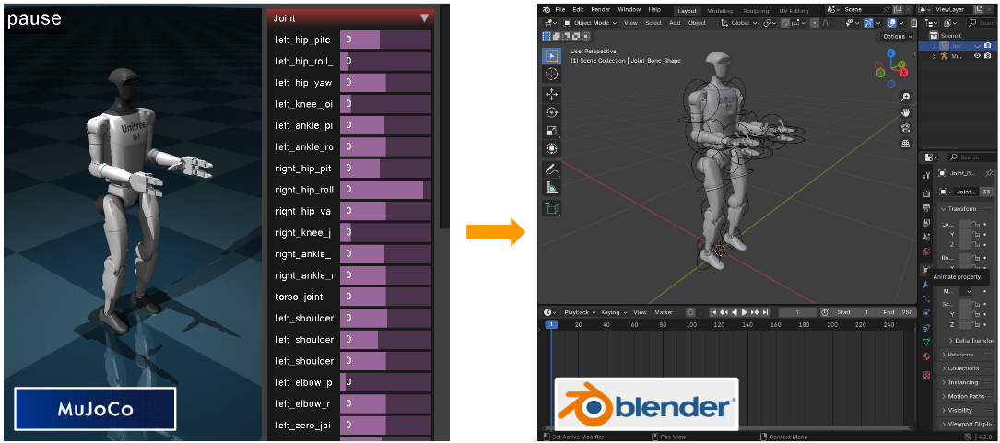
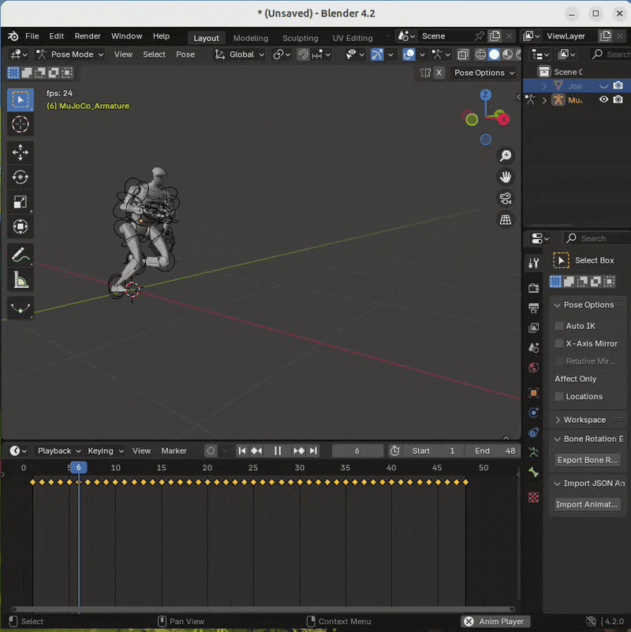

# blender_mujoco

**This repository is in prototype mode**
I've only tested it on one [xml file](https://github.com/danieldugas/DeepMimic_mujoco/blob/8ee8f10c4bc1c930d1cbbed2fe5b9a58a73b58bc/src/mujoco/humanoid_deepmimic/envs/asset/deepmimic_unitree_g1.xml)

### mujoco_importer

Import a robot from a MuJoCo `.xml` file into blender.

- **Blender** > **Scripting** (top tab) > **Open File** (folder icon) > mujoco_importer.py
- **Run Script** (play button)
- Make sure `.xml` file and all necessary meshes are in correct folder structure (in my case, `unitree_g1.xml`, and meshes in `assets` folder)
- **File** > **Import** > **MuJoCo XML**

### joint_anim_importer

Import animation of mujoco joints

tested on [this mocap file](https://github.com/danieldugas/DeepMimic_mujoco/blob/967f4c255b41afcacb25d694c1ff2016129db2a4/src/mujoco/motions/unitree_g1_run.txt)

- Make sure the MuJoCo armature has been created
- **Tools** (Right panel, screwdriver/wrench icon) > **Import Animation from JSON**

### joint_anim_exporter

Export animation frames of joint rotations